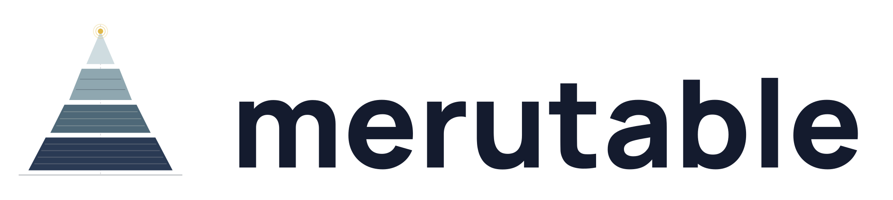

<p align="center">
  
</p>

<p align="center">
  <a href="https://github.com/merutable/merutable/actions/workflows/ci.yml"></a>
  <a href="https://crates.io/crates/merutable"></a>
  <a href="https://docs.rs/merutable"></a>
  <a href="LICENSE"></a>
</p>

<p align="center"><b>An embeddable Rust table engine. LSM writes, Parquet storage, Iceberg-compatible metadata.</b></p>

> **🚧  0.0.1 preview.** Storage format is already Iceberg v2–compatible and
> CI-pinned. The public Rust API is not yet stable — treat 0.x as a design
> surface, not a deployment target. Not production-ready.

---

`merutable` is a single-table LSM storage engine you link into your process,
not a server you deploy. Writes go through a WAL + skip-list memtable; flushes
land as Apache Parquet SSTables; every commit publishes a manifest that is a
strict superset of Apache Iceberg v2 `TableMetadata`. The same bytes your
writes land in are the bytes DuckDB, Spark, Trino, Snowflake, and pyiceberg
read — no export, no format conversion.

```rust
use merutable::{MeruDB, OpenOptions};
use merutable::schema::{ColumnDef, ColumnType, TableSchema};
use merutable::value::{FieldValue, Row};

#[tokio::main]
async fn main() -> merutable::error::Result<()> {
    let schema = TableSchema {
        table_name: "events".into(),
        columns: vec![
            ColumnDef { name: "id".into(),      col_type: ColumnType::Int64,     nullable: false, ..Default::default() },
            ColumnDef { name: "payload".into(), col_type: ColumnType::ByteArray, nullable: true,  ..Default::default() },
        ],
        primary_key: vec![0],
        ..Default::default()
    };

    let db = MeruDB::open(OpenOptions::new(schema)).await?;

    db.put(Row::new(vec![
        Some(FieldValue::Int64(1)),
        Some(FieldValue::Bytes(b"hello"[..].into())),
    ])).await?;

    let row = db.get(&[FieldValue::Int64(1)])?;
    println!("{row:?}");

    db.close().await?;   // flush + fsync + seal; reads remain until drop
    Ok(())
}
```

## When merutable fits

**Yes:** structured data at a single-process scope that needs to be both
write-fast (agent memory, session state, audit logs, feature stores, embedded
time-series) and also readable by external analytical engines without an ETL
job. An LSM gives you the writes; Iceberg-compatible manifests give you the
reads. Your process is the source of truth; DuckDB or Spark are guests.

**No:** multi-table OLTP, cross-table transactions, multi-writer object-store
layouts, a replacement for PostgreSQL or Snowflake. merutable ships no SQL
surface on the primary table (reads and writes are through a typed Rust KV
API); the only SQL entry point is the change-feed `TableProvider` you
register on your own DataFusion `SessionContext`. Analytical queries over
the primary table run in external engines on the Parquet files merutable
writes. See [`docs/TAXONOMY.md`](docs/TAXONOMY.md) for what each word in
the tagline earns.

## What's in the box

- **Durable LSM write path.** Write-ahead log with 32 KiB block framing and
  CRC32, crossbeam skip-list memtable, graduated writer backpressure on
  L0-file buildup. `visible_seq` advances only after the memtable apply, so
  readers never observe a torn write.
- **Leveled compaction.** Full-rewrite, run in parallel on disjoint level
  sets, bounded per-job memory, fsync-before-commit, version-pinned GC so
  a long scan never sees a file disappear mid-read.
- **Iceberg v2-superset manifest.** Every commit emits a native JSON manifest
  that carries `table_uuid`, `last_updated_ms`, parent-snapshot chain,
  `schemas[]`, and additive-evolution fields (`field_id`, `initial_default`,
  `write_default`). `db.export_iceberg(path)` writes a spec-clean Iceberg v2
  chain — `metadata.json` + manifest-list Avro + manifest Avro — that DuckDB
  `iceberg_scan`, pyiceberg, Spark, Trino, and Athena consume as-is. CI
  round-trips the manifest chain through `iceberg-rs`.
- **Change feed.** `merutable::sql::datafusion_provider::ChangeFeedTableProvider`
  exposes the committed op log as a DataFusion `TableProvider` (`seq > N`
  predicates push down as `Exact`), with per-DELETE pre-image reconstruction.
- **Scale-out read replica** *(opt-in, `replica` feature).* Read-only base
  + tail replayed from the change feed; rebase hot-swaps behind `ArcSwap`
  so in-flight readers never see a torn state. v1 `LogSource` is in-process;
  a transport shipping the tail across hosts is follow-on work.
- **Additive schema evolution.** `db.add_column(ColumnDef)` — reopen accepts
  the extension, reads of pre-evolution files fill defaults, writes pad
  short rows with `write_default`.
- **Python bindings** *(via PyO3).* `crates/merutable-python/`.

## Install

```toml
[dependencies]
merutable = "0.0.1"
```

Cargo features:

| Feature    | Default | What it pulls in                                                                 |
|------------|---------|----------------------------------------------------------------------------------|
| `sql`      | ✅       | DataFusion `TableProvider` wrapper for the change feed.                          |
| `replica`  | —       | Scale-out RO replica. Implies `sql`.                                             |

```bash
cargo add merutable                            # default (sql on)
cargo add merutable --no-default-features      # core engine only
cargo add merutable --features replica         # + replica module
```

## Architecture at a glance

```
          ┌──────── your process ────────┐
writes ──▶│ WAL → memtable → flush → SST │
reads  ◀──│   memtable  ∪  L0  ∪  L1…    │
          └─────────────┬────────────────┘
                        │    Parquet + Iceberg v2 metadata
                        ▼
           DuckDB / Spark / Trino / pyiceberg
                  (no ETL, same bytes)
```

Deeper reads:
[`docs/architecture.svg`](docs/architecture.svg) ·
[`docs/SEMANTICS.md`](docs/SEMANTICS.md) ·
[`docs/EXTERNAL_READS.md`](docs/EXTERNAL_READS.md) ·
[`docs/MIRROR.md`](docs/MIRROR.md) ·
[`docs/SCALE_OUT_REPLICA.md`](docs/SCALE_OUT_REPLICA.md) ·
[`docs/TAXONOMY.md`](docs/TAXONOMY.md) ·
[`DEVELOPER.md`](DEVELOPER.md)

## Lab notebook

[`lab/lab_merutable.ipynb`](lab/lab_merutable.ipynb) — a live, runnable
showcase comparing merutable against DuckDB head-to-head, then demonstrating
the zero-ETL federated read (fresh memtable rows inside merutable, columnar
analytical reads from DuckDB against the same on-disk Parquet).

```bash
cd lab && bash setup.sh
```

## Status

| Area              | 0.0.1                                                               |
|-------------------|---------------------------------------------------------------------|
| Storage format    | Iceberg v2-compatible, CI-pinned via round-trip deserialization.    |
| Rust public API   | Unstable. Expect breaking changes across 0.x.                        |
| Python API        | Unstable. Matches the Rust surface.                                  |
| Durability        | fsync on SST write, fsync on WAL, fsync on manifest commit.          |
| Concurrency       | Designed for one primary writer per catalog (not yet lock-enforced); many concurrent readers via version pinning. |
| Deployment target | Single process, local disk. Object-store primary is not yet shipped. |

## License

Apache-2.0. See [`LICENSE`](LICENSE).

Named after [Mount Meru](https://en.wikipedia.org/wiki/Mount_Meru) — the axis
around which the cosmos is ordered in Indian cosmology.
