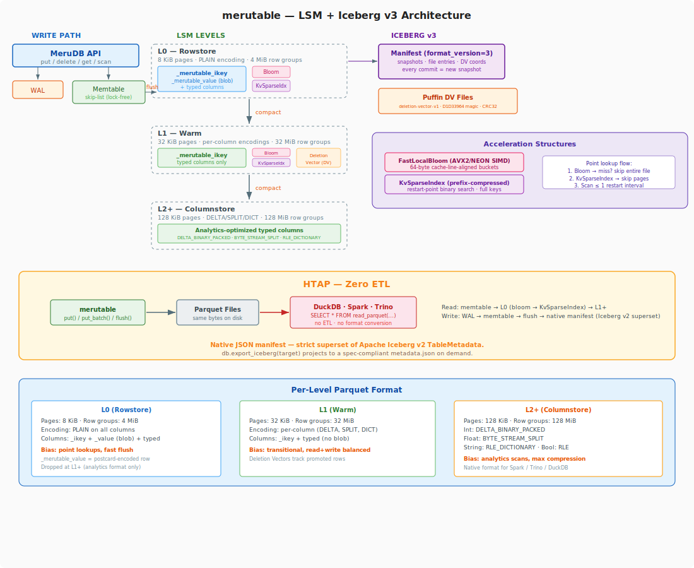

# merutable

[](https://github.com/merutable/merutable/actions/workflows/ci.yml)
[](https://www.rust-lang.org/)
[](LICENSE)

An embeddable Rust HTAP database engine. One logical table backed by an LSM-tree: SSTables are Apache Parquet files, deletion vectors are Apache Iceberg v3 `deletion-vector-v1` Puffin blobs, and each commit writes a native JSON manifest that is a **strict superset of Apache Iceberg v2 `TableMetadata`** — losslessly projectable onto a spec-compliant Iceberg table via [`merutable-iceberg::translate`](crates/merutable-iceberg/src/translate.rs) and exportable on demand with `db.export_iceberg(target_dir)`. DuckDB, Spark, Trino, and pyiceberg read the exported view; the Parquet files themselves are the single source of truth — no ETL, no format conversion.

Named after the [Meru Parvatha](https://en.wikipedia.org/wiki/Mount_Meru) from Indian mythology.

## Why merutable

- **HTAP in one binary**: Transactional writes (put/delete/scan) with sub-millisecond memtable lookups. On-disk data files are Apache Parquet — DuckDB, Spark, Trino read them directly. No ETL, no format conversion.
- **Iceberg-native**: Every commit writes a JSON manifest that is a strict superset of Apache Iceberg v2 `TableMetadata`. Call `db.export_iceberg(target)` to project onto a spec-compliant `metadata.json` for pyiceberg / Spark / DuckDB / Snowflake. Compatibility is CI-pinned via `iceberg-rs` round-trip.
- **Deletion Vectors**: Compaction masks rows via Iceberg v3 `deletion-vector-v1` Puffin blobs (roaring bitmaps). Source Parquet files stay readable throughout — no rewrite-in-place.
- **Fast point lookups**: SIMD bloom filter (AVX2/NEON, cache-line-aligned) skips entire files. Prefix-compressed sparse index with restart-point binary search skips pages within files.
- **Row cache**: LRU cache between memtable and Parquet I/O. Never stale — invalidated on write, cleared on compaction.
- **Crash-safe**: SST fsync → directory fsync → manifest commit → version-hint swap. Correct durability ordering end-to-end.
- **Linearizable reads**: No torn-read window under concurrent writes.
- **Graceful shutdown**: `db.close()` flushes memtable to Parquet, fsyncs, seals. Reads stay available; writes are rejected.
- **Read-only replica**: `open_read_only()` + `refresh()` picks up new snapshots from the primary.
- **Pluggable storage**: Local FS or S3 with LRU disk cache.

## Architecture

<p align="center">
  
</p>

`IcebergCatalog` manages the single table's native manifest chain (`metadata/v{N}.metadata.json` + `version-hint.text`). The manifest is a superset of Iceberg v2 `TableMetadata` — every field Iceberg needs (`table_uuid`, `last_updated_ms`, `parent_snapshot_id`, `sequence_number`, `schemas[]`) is already stored, so projection is a pure function with no data loss. Catalog integration (Hive, Glue, REST, etc.) is an external layer on top — merutable provides the table artifacts, not the catalog service.

**Write path**: Under WAL lock: sequence allocate → WAL append → memtable insert → advance `visible_seq`. Flush when threshold crossed. Each flush writes a new Parquet SST (fsynced), then commits a new `v{N}.metadata.json` and installs a new `Version` via `ArcSwap`.

**Read path**: Memtable (active + immutable queue) → L0 files (bloom → `KvSparseIndex` page skip → scan) → L1..LN (bloom → `KvSparseIndex` → binary search).

**Compaction**: Leveled compaction with Deletion Vector tracking. Output SST is fsynced before manifest commit. Fully compacted files are removed from the manifest and queued for deferred deletion (grace period for HTAP readers); partially compacted files get a Puffin `deletion-vector-v1` blob (with post-union cardinality validation) pointing at the deleted row positions. Row cache is cleared on every compaction commit. Snapshot-aware version dropping preserves MVCC versions needed by active readers. Each compaction commit is a new `v{N}.metadata.json`.

**Iceberg translation**: Call `db.export_iceberg(target_dir)` at any time to emit a spec-compliant Iceberg v2 `metadata.json` under `target_dir/metadata/v{N}.metadata.json` plus a `version-hint.text`. Spec compliance is pinned by a CI test that round-trips the emitted JSON through the `iceberg-rs` `TableMetadata` deserializer. Manifest-list / manifest Avro file emission is tracked as follow-on work; for inspection, catalog registration, and schema audit the `metadata.json` alone is sufficient.

## Crate map

| Crate | Responsibility |
|---|---|
| `merutable-types` | `InternalKey` encoding, `TableSchema`, `FieldValue`, `SeqNum`, `OpType`, `MeruError` |
| `merutable-wal` | 32 KiB block format WAL with CRC32, recovery, rotation |
| `merutable-memtable` | `crossbeam` skip-list memtable, `bumpalo` arena, rotation, flow control |
| `merutable-parquet` | Parquet SSTable writer/reader, `FastLocalBloom`, `KvSparseIndex`, footer KV metadata |
| `merutable-iceberg` | Native JSON manifest + `VersionSet` (ArcSwap) + `DeletionVector` (Puffin v3 `deletion-vector-v1`) + `translate` module projecting snapshots onto Apache Iceberg v2 `TableMetadata`. Not a catalog — catalog integration (Hive, Glue, REST) is external. |
| `merutable-store` | Pluggable object store: local FS, S3, LRU disk cache |
| `merutable-engine` | `FlushJob`, `CompactionJob`, `MergingIterator`, `RowCache`, read/write paths |
| `merutable` | Public embedding API: `MeruDB`, `OpenOptions`, `ScanIterator` |

## Storage tuning

The LSM tree uses level-aware Parquet tuning to serve both OLTP and OLAP workloads:

| Level | Row group | Page size | Encoding | Tuning biased for |
|-------|-----------|-----------|----------|-------------------|
| L0 | 4 MiB | 8 KiB | PLAIN (all columns) | Rowstore — point lookups, memtable flush |
| L1 | 32 MiB | 32 KiB | Per-column (see below) | Warm — transitional |
| L2+ | 128 MiB | 128 KiB | Per-column (see below) | Columnstore — analytics scans |

**Per-column encoding at L1+:**
- `_merutable_ikey` (lookup key): PLAIN — zero-overhead decode for point lookups
- `Int32`/`Int64`: DELTA_BINARY_PACKED — optimal for sorted integer columns
- `Float`/`Double`: BYTE_STREAM_SPLIT — IEEE 754 byte-transposition
- `ByteArray` (strings): RLE_DICTIONARY — high compression for categorical data
- `Boolean`: RLE

L0 files carry both `_merutable_ikey` + `_merutable_value` (postcard blob for KV fast-path) and typed columns. L1+ files drop the blob and store only `_merutable_ikey` + typed columns — the analytical format external engines read.

## Quick start

```rust
use merutable::{MeruDB, OpenOptions};
use merutable::merutable_types::schema::{TableSchema, ColumnDef, ColumnType};
use merutable::merutable_types::value::FieldValue;

#[tokio::main]
async fn main() {
    let schema = TableSchema {
        table_name: "events".into(),
        columns: vec![
            ColumnDef { name: "id".into(), col_type: ColumnType::Int64, nullable: false },
            ColumnDef { name: "payload".into(), col_type: ColumnType::ByteArray, nullable: true },
        ],
        primary_key: vec![0],
    };

    let db = MeruDB::open(OpenOptions::new(schema)).await.unwrap();
    db.put(&[FieldValue::Int64(1)], &[FieldValue::Int64(1), FieldValue::Null]).await.unwrap();
    let row = db.get(&[FieldValue::Int64(1)]).unwrap();
    println!("{row:?}");

    // Graceful shutdown — flushes memtable to Parquet, fsyncs, and
    // rejects further writes. Reads remain available until drop.
    db.close().await.unwrap();
}
```

## Interactive notebook

The [`lab/lab_merutable.ipynb`](lab/lab_merutable.ipynb) notebook is a live, runnable showcase — open it on GitHub to see pre-rendered outputs, or run it locally for the full interactive experience:

```bash
cd lab && bash setup.sh
```

The notebook covers: write/flush/inspect, compaction with Deletion Vectors, **HTAP with DuckDB** (SQL queries on merutable's Parquet files — zero ETL), acceleration structures (bloom filter + KvSparseIndex), and write/read performance benchmarks.

## Python bindings

merutable ships a PyO3 crate (`merutable-python`) that exposes the full API to Python:

```python
from merutable import MeruDB

db = MeruDB("/tmp/mydb", "events", [
    ("id",     "int64",  False),
    ("name",   "string", True),
    ("score",  "double", True),
    ("active", "bool",   True),
])

db.put({"id": 1, "name": "alice", "score": 95.5, "active": True})
row = db.get(1)         # {'id': 1, 'name': 'alice', 'score': 95.5, 'active': True}

# Batch writes — single WAL sync per batch, 100-1000× faster than individual puts
db.put_batch([
    {"id": 2, "name": "bob",   "score": 88.0, "active": True},
    {"id": 3, "name": "carol", "score": 92.1, "active": False},
])

db.flush()              # → L0 Parquet file + new v{N}.metadata.json
db.compact()            # → L1 columnstore + Deletion Vectors (Puffin v3)
print(db.stats())       # includes cache hit/miss counters

# HTAP: DuckDB reads the same Parquet files
import duckdb
duckdb.sql(f"SELECT * FROM read_parquet('{db.catalog_path()}/data/L1/*.parquet')").show()

# Read-only replica — opens same catalog, no WAL, no writes
replica = MeruDB("/tmp/mydb", "events", [...], read_only=True)
replica.get(1)          # reads from Parquet files
replica.refresh()       # picks up new snapshots from the primary

# Hand the current snapshot to any Iceberg v2 reader
db.export_iceberg("/tmp/events-iceberg")   # writes metadata/v{N}.metadata.json
# Then, e.g.:
#   from pyiceberg.table import StaticTable
#   t = StaticTable.from_metadata("/tmp/events-iceberg/metadata/v1.metadata.json")
#   t.schema()              # ← full Iceberg v2 schema, table_uuid, snapshot chain

# Graceful shutdown — flush + fsync + seal
db.close()              # writes are rejected after this; reads still work
```

Build with [maturin](https://www.maturin.rs/):
```bash
cd crates/merutable-python && maturin develop --release
```

## License

Apache-2.0
